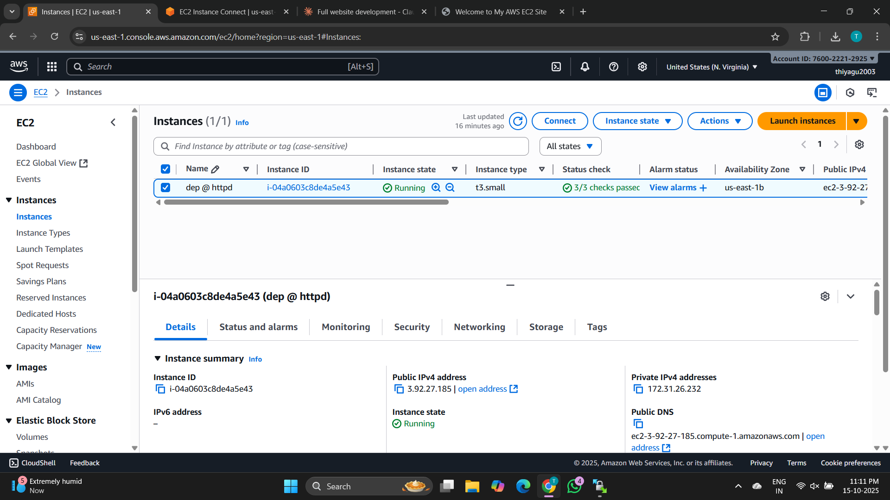
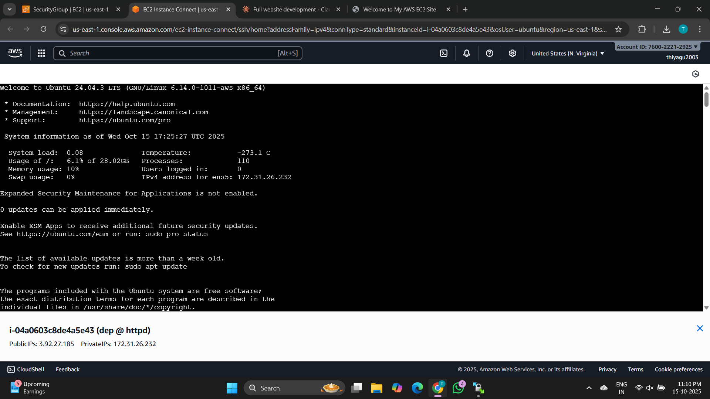
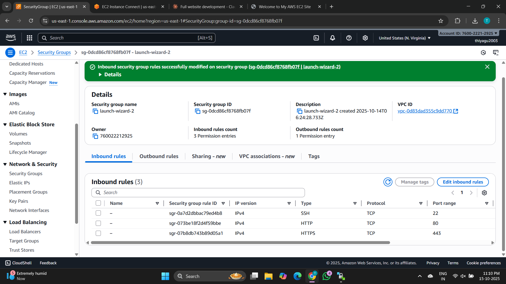
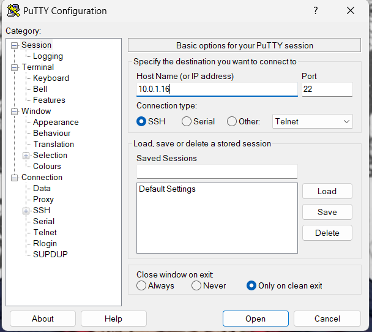
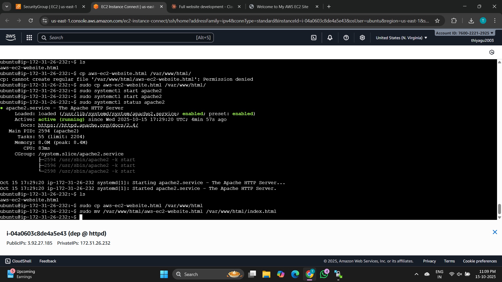
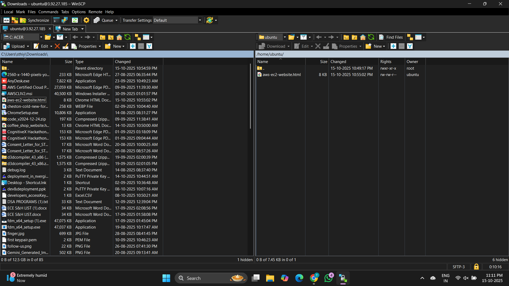
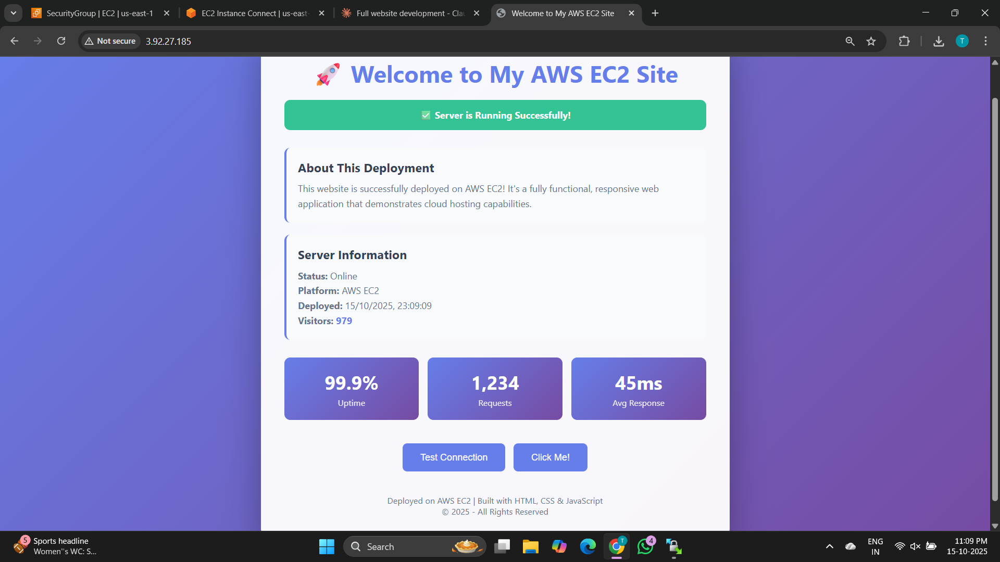

Excellent ✅ — here’s your **final, full, and complete `README.md`** for deploying a **static website on AWS EC2 (Ubuntu) using Apache2**, now including a **dedicated Security Group Configuration section** (with screenshot reference), **PuTTY connection**, and everything formatted cleanly for GitHub.

You can copy this directly into your repository’s `README.md` file.

---

# 🚀 Deploying a Static Website on AWS EC2 using Apache2

This project documents the process of deploying a **simple static website** on an **Amazon EC2 instance** running **Ubuntu** using **Apache2** as the web server.

---

## 🧠 Overview

I successfully hosted a static website on **AWS EC2** by configuring an **Ubuntu instance**, installing and setting up **Apache2**, and transferring files using **WinSCP**.
The website is now accessible through the EC2 public IP address.

---

## 🛠️ Technologies Used

* **AWS EC2 (Ubuntu 22.04)**
* **Apache2**
* **WinSCP** (for file transfer)
* **PuTTY / EC2 Instance Connect** (for SSH access)
* **HTML, CSS** (Static website files)

---

## ⚙️ Deployment Steps

### 🖥️ Step 1: Launch an EC2 Instance

1. Open the **AWS Management Console**.
2. Navigate to **EC2** and click **Launch Instance**.
3. Choose **Ubuntu Server (Free Tier eligible)**.
4. Select instance type: `t2.micro`.
5. Create or choose an existing key pair.
6. Proceed to **Network Settings** to configure the **Security Group**.
7. Review and **Launch the instance**.

**📸 Screenshot:**




---

### 🔐 Step 2: Configure Security Group

Security Groups control inbound and outbound traffic for your EC2 instance.
To allow access to your website and SSH, configure the following rules:

**📸 Screenshot:**


---

### 🔗 Step 3: Connect to the EC2 Instance

You can connect to your EC2 instance using **one of the following methods** 👇

---

#### 🧩 Method 1: EC2 Instance Connect (Browser-Based SSH)

1. In the AWS Console, go to **EC2 → Instances**.
2. Select your instance and click **Connect**.
3. Choose **EC2 Instance Connect** → Click **Connect**.

A terminal will open directly in your browser window.

---

#### 🧩 Method 2: PuTTY (Windows SSH Client)

If you’re on Windows, use **PuTTY** for secure SSH access.

1. **Convert your `.pem` key to `.ppk`** using **PuTTYgen**:

   * Open **PuTTYgen** → Click **Load** and select your `.pem` file.
   * Click **Save private key** → save it as `mykey.ppk`.

2. **Open PuTTY** and enter:

   * **Host Name (or IP):** `ubuntu@<your-ec2-public-ip>`
   * **Port:** `22`
   * **Connection type:** SSH

3. Go to **Connection → SSH → Auth → Credentials**,
   and browse to your **.ppk** key file.

4. Click **Open** to connect to your instance.

You’ll see the Ubuntu terminal login prompt.

**📸 Screenshot:**


---

### 🌐 Step 4: Update System and Install Apache2

Run the following commands in your terminal:

```bash
sudo apt update
sudo apt install apache2 -y
```

Check Apache2 service status:

```bash
sudo systemctl status apache2
```

If inactive, start it:

```bash
sudo systemctl start apache2
```

Enable Apache2 to start automatically at boot:

```bash
sudo systemctl enable apache2
```

**📸 Screenshot:**


---

### 📂 Step 5: Transfer Website Files using WinSCP

1. Open **WinSCP** and select **SFTP** as the file protocol.

2. Enter the following details:

   * **Host name:** `<your-ec2-public-ip>`
   * **Username:** `ubuntu`
   * **Private key file:** select your `.pem` key.

3. Click **Login**.

4. Navigate to the web root directory:

   ```
   /var/www/html/
   ```

5. Delete the default `index.html` file (optional).

6. Upload your website files (`index.html`, `style.css`, etc.) here.

**📸 Screenshot:**


---

### 🌎 Step 6: Verify Deployment

Open your browser and visit:

```
http://<your-ec2-public-ip>
```

If everything is configured correctly, your static website should load successfully 🎉

**📸 Screenshot:**


---

### 🔒 Step 7: Configure Firewall (Optional)

Enable Apache through Ubuntu’s UFW firewall:

```bash
sudo ufw allow 'Apache Full'
sudo ufw enable
```

Check firewall status:

```bash
sudo ufw status
```

---

### 🌐 Step 8: (Optional) Enable Custom Domain and SSL

For a professional deployment, you can configure:

* **Custom domain** using **Amazon Route 53**
* **Free HTTPS SSL certificate** using **Let’s Encrypt (Certbot)**

Install Certbot and enable SSL:

```bash
sudo apt install certbot python3-certbot-apache -y
sudo certbot --apache
```

Follow the on-screen instructions to automatically install an SSL certificate.

---

## ✅ Summary

* Deployed a **static website** on **AWS EC2 (Ubuntu 22.04)**
* Installed and configured **Apache2** web server
* Used **PuTTY** or **EC2 Instance Connect** for SSH access
* Used **WinSCP** for file transfer
* Configured **Security Group** for HTTP, HTTPS, and SSH
* Verified website deployment via EC2 public IP
* Optionally secured with **SSL** using Let’s Encrypt

---

## 👤 Author

**Thiyagu S**
Deployed with ❤️ on **AWS Cloud** using **EC2 & Apache2**.

---


